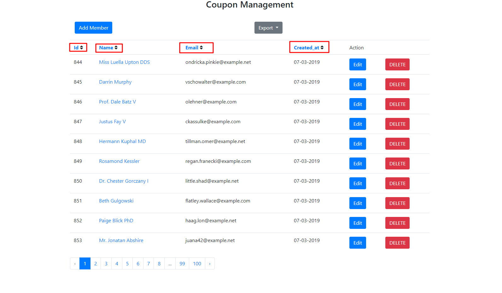
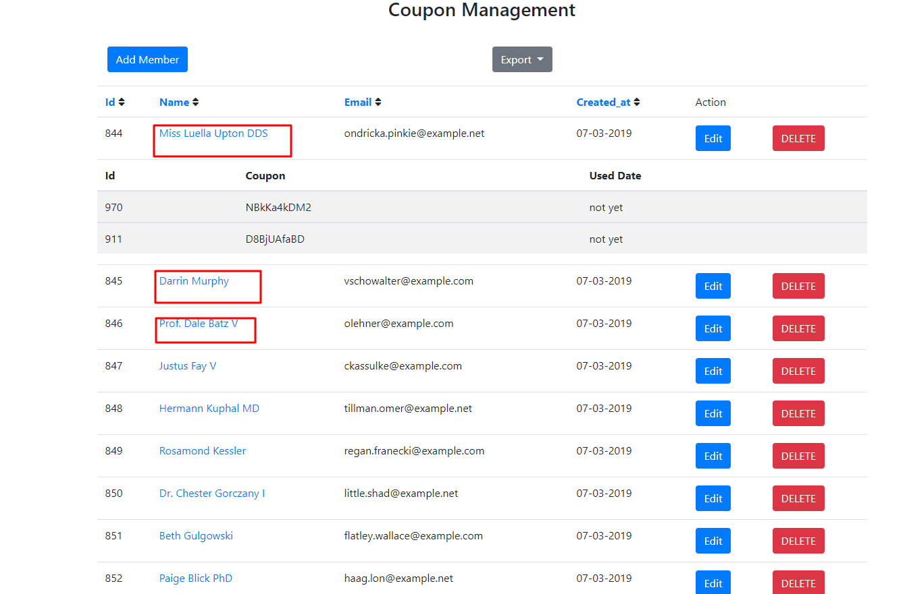

# Member's Coupon Management

A simple CMS  application built with Laravel 5.7

## Install 
 - Run command
 ```
 composer install
 ```
 - Clone .env.example file to .env file
 - Import database from db.sql file
 - Edit database info in .env file
 
 ## Usage
 - Run command 
 ```
php artisan serve
```
 - Access http://localhost:8000/members 
 - You can sort by column via clicking column name: 
 
 - Click member name to view their coupons:
  
  
## API
 Import collection from coupons.postman_collection.json
 1. Customer redeems a coupon from the Redemption Center 
   + URL : http://localhost:8000/api/coupons
   + Method : PUT
   + Body example :
   ```
   {
   	"member_id" : 844,
   	"coupon_id" : 970
   }
   ```
   + Response example :
   ```  
   {
       "status": true,
       "data": {
           "id": 970,
           "code": "NBkKa4kDM2",
           "created_at": "2019-03-07 07:43:14",
           "updated_at": "2019-03-07 07:43:14",
           "deleted_at": null
       }
   }
   ```
  2 . Customer uses his own coupon from his wallet .
   + URL : http://localhost:8000/api/coupons/apply
    + Method : POST
      + Body example :
      ```
      {
      	"member_id" : 844,
      	"code" : "NBkKa4kDM2"
      }
      ```
      + Response example :
      ```  
     {
         "status": true,
         "data": "SUCCESSFULLY"
     }
      ```
## License

See [LICENSE](LICENSE) for more info.